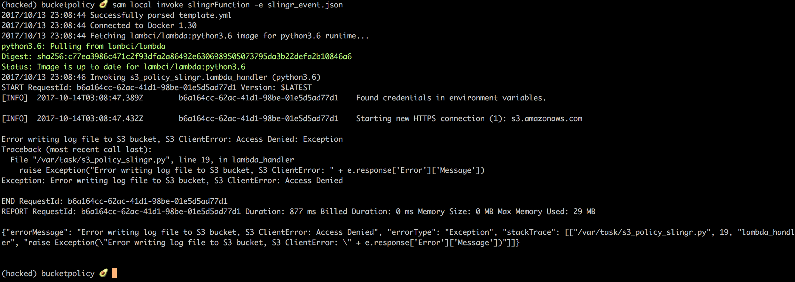

# HACKRU challenge
Best pull request for a feature or experiment (deadline is Sunday) 

Some initial ideas can be found @ https://github.com/Optum/ChaoSlingr/projects/1 or look for branches prefixed with hackru_ we will be hacking our own project this weekend

Questions: come to our booth or ask questions @ https://chaoslingr.slack.com

# How to begin
The first experiment is about trying to access an S3 Bucket (object store file system) where you shouldn't have access to because there should be bucket policies denying such upload. 

You will need docker, node, and python installed on your workstation 
1. `git clone -b hackRU https://github.com/Optum/ChaoSlingr.git`
2. `virtualenv hacked`
3. `source hacked/bin/activate` 
    - if using a windows cmd `hacked\Scripts\activate`
4. `pip install localstack`
5. `npm install -g aws-sam-local`
6. `localstack start` or if you want to run in background `localstack start &` 
    - if using windows cmd `python hacked\Scripts\localstack start --docker`
7. `aws --endpoint-url=http://localhost:4572 s3api create-bucket --bucket test-bucket --region us-east-1` (you just made your first AWS call!)
    - check with `aws --endpoint-url=http://localhost:4572 s3 ls` and you should see something like `2006-02-03 11:45:09 test-bucket`
8. `cd ChaoSlingr/test/bucketpolicy/`
9. `sam local invoke slingrFunction -e slingr_event.json` 

Cool you just ran your first experiment. What should of happened is output like this

# If you found AWS Credit begin by
Find some AWS credit and make your own account to move from local env to public cloud. 

### Using SAM
1. `git clone -b hackru https://github.com/Optum/ChaoSlingr.git`
2. `npm install -g aws-sam-local`
3. `cd src/lambda/bucketpolicy`
4. `sam deploy --template-file ./packaged.yaml --stack-name chaostest --capabilities CAPABILITY_IAM`

# ChaoSlingr: Introducing Security into Chaos Testing
ChaoSlingr is a Security Chaos Engineering Tool focused primarily on the experimentation on AWS Infrastructure to bring system security weaknesses to the forefront.

Join the community - https://chaoslingr.slack.com
