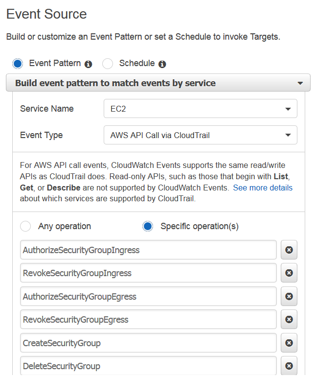

# PortChange_Slack_Trackr Initial Setup

Create a new CloudTrail for Trackr.

Create a new CloudWatch alarm. Select the Custom Metric, CloudTrailMetrics. Select Metric Name, SecurityGroupEventCount. Trigger when SecurityGroupEventCount is >= 1.

Create a new CloudWatch Rule. Set up Event Source as so:

Go to the PortChange_Slack_Trackr Lambda function and add trigger, CloudWatch Events, and use the CloudWatch Rule created earlier.
